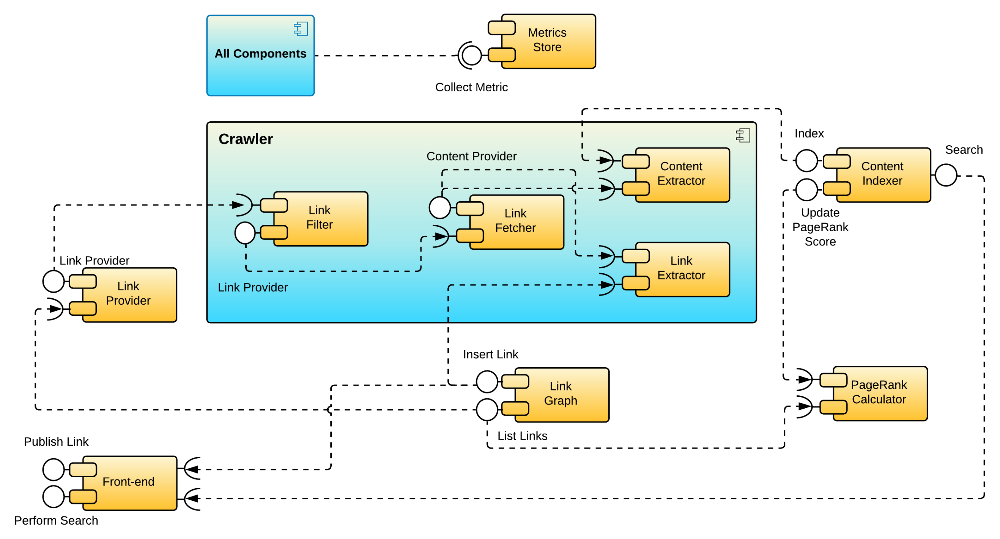

# Introduction

Search Engine is an educational project and functional search engine. The purpose was to explore and familiarise with
various technology and demonstrate an understanding of fundamental software engineering concepts.

To begin with, the project employs a `monolithic` architecture. The components are built using the `proxy` design
pattern which allows them to remain decoupled and communicate with each other. This allows for extracting components
into their own service should the need arise and make the transition to a `microservice` architecture simple.

The project adheres to `SOLID` principles. _(3)_

- **Single Responsibility Principle**

  > "A class should have one, and only one, reason to change."

- **Open-Closed Principle**

  > "You should be able to extend a classes behaviour without modifying it."

- **Liskov Substitution Principle**

  > "Derived classes must be substitutable for their base classes."

- **Interface Segregation Principle**

  > "Make fine-grained interfaces that are client-specific."

- **Dependency Inversion Principle**

  > "Depend on abstractions, not on concretions."

The project adopts an `Agile` approach to quickly build components and work in small iterations to have a working
prototype as fast as possible. `User Stories` were created to gather requirements and indicate the set of high-level
components needed; these were then turned into cards and organised on a `Kanban` board to aid development.

# Requirements Analysis

We answer two things: *what* do we need to develop, and *how completely* would it meet our requirements. `User Stories`
use the template from Attislan. _(2)_

## Functional Requirements

---

### **User Story - Link Submission**

> As an... **end-user**,
> I need to be able to... **submit new links**,
> So as to... **update the link graph and make their contents searchable**.

**Acceptance criteria:**

- A frontend or API endpoint for end-users to submit links.
- Submitted links must be added to the graph and must be crawled by the system and indexed.
- Already submitted links should be accepted by the backend but not inserted twice into the graph.

### **User Story - Search**

> As an... **end-user**,
> I need to be able to... **submit full-text search queries**,
> So as to... **retrieve a list of relevant results from the indexed content.**

**Acceptance criteria:**

- A frontend or API endpoint for end-users to submit a full-text query.
- Paginate results when a query returns multiple matches.
- Each entry in the result list must contain the following items: title or link description, the link to the content,
  and a timestamp indicating when the link was last crawled.
- When the query results in no matches, an appropriate response must be returned to the user.

### **User Story - Crawl Link Graph**

> As a... **crawler backend system**,
> I need to be able to... **obtain a list of sanitised links**,
> so as to... **fetch and index their contents while also expanding the link graph with newly discovered links.**.

**Acceptance criteria:**

- The crawler can query the link graph and receive a list of stale links that need to be crawled.
- Links received by the crawler are retrieved from the remote hosts unless the remote server provides an ETag or
  Last-Modified header that the crawler has already seen before.
- Retrieved content is scanned for links, and the link graph gets updated.
- Retrieved content is indexed and added to the search corpus.

### **User Story - Calculate PageRank Scores**

> As a... **PageRank calculator backend system**,
> I need to be able to... **access the link graph**,
> So as to... **calculate and persist the PageRank score for each link**.

**Acceptance criteria:**

- The PageRank calculator can obtain an immutable snapshot of the entire link graph.
- A PageRank score is assigned to every link in the graph.
- The search corpus entries are annotated with the updated PageRank scores.

### **User Story - Monitor Service Health**

> As a... **Member of the** **engineering team**,
> I need to be able to... **monitor the health of the application and services**,
> So as to... **detect and address application issues**.

**Acceptance criteria:**

- All services should periodically submit health- and performance-related metrics to a centralised metrics collection
  system.
- A monitoring dashboard is created for each service.
- A high-level monitoring dashboard tracks the overall system health.
- Metric-based alerts are defined and linked to a paging service.

## Non-functional Requirements

---

### Service-level Objectives

| Metric                               | Expectation                   | Measurement Period | Notes                                                                                        |
|--------------------------------------|-------------------------------|--------------------|----------------------------------------------------------------------------------------------|
| Website availability                 | 99% uptime                    | Yearly             | Tolerates up to 3d 15h 39m of downtime per year                                              |
| Index service availability           | 99.9% uptime                  | Yearly             | Tolerates up to 8h 45m of downtime per year                                                 |
| PageRank service availability        | 70% uptime                    | Yearly             | Not a user-facing component of our system; the service can endure longer periods of downtime |
| Search response time                 | 30% requests answered in 0.5s | Monthly            |                                                                                              |
| Search response time                 | 70% requests answered in 1.2s | Monthly            |                                                                                              |
| Search response time                 | 99% requests answered in 2.0s | Monthly            |                                                                                              |
| CPU utilisation for PageRank service | 90%                           | Weekly             | should not be paying for idle computing nodes                                                 |                                                   |

### System Component Model

UML component diagram for the search engine. _(1)_

# Acknowledgements

# References

1. [Hands-On Software Engineering with Golang - Achilleas Anagnostopoulos [Packt Publishing]](https://www.amazon.co.uk/Hands-Software-Engineering-Golang-programming/dp/1838554491)
1. [https://www.atlassian.com/agile/project-management/user-stories](https://www.atlassian.com/agile/project-management/user-stories)
3. [https://team-coder.com/solid-principles/](https://team-coder.com/solid-principles/)

