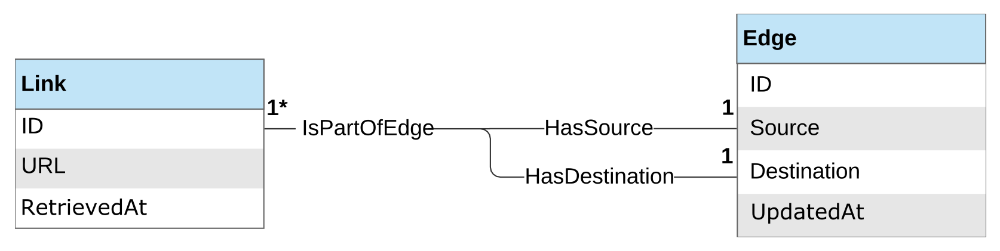

# Introduction

Search Engine is a personal, educational project and functional search engine. The purpose was to explore and
familiarise myself with various technology and demonstrate an understanding of fundamental software engineering
concepts.

Initially, the project employs a monolithic architecture. The components are built using the `proxy` design pattern that
allows them to remain decoupled and communicate - this allows for extracting components into a separate service should
the need arise and simplify the transition to a `microservice` architecture.

The project adheres to `SOLID` principles. <small>_[3]_</small>

- **Single Responsibility Principle**

  > "A class should have one, and only one, reason to change."

- **Open-Closed Principle**

  > "You should be able to extend a classes behaviour without modifying it."

- **Liskov Substitution Principle**

  > "Derived classes must be substitutable for their base classes."

- **Interface Segregation Principle**

  > "Make fine-grained interfaces that are client-specific."

- **Dependency Inversion Principle**

  > "Depend on abstractions, not on concretions."

The project adopts an `Agile` approach to quickly build components and work in small iterations to have a working
prototype as fast as possible. `User Stories` were created to gather requirements and indicate the set of high-level
components needed; these were then turned into cards and organised on a `Kanban` board to aid development.

# Requirements Analysis

We answer two things: *what* do we need to develop, and *how completely* would it meet our requirements. `User Stories`
use the template from Attislan. <small>_[2]_</small>

## Functional Requirements

### **User Story - Link Submission**

> As an... **end-user**,
> I need to be able to... **submit new links**,
> So as to... **update the link graph and make their contents searchable**.

**Acceptance criteria:**

- A frontend or API endpoint for end-users to submit links.
- Submitted links must be added to the graph and must be crawled by the system and indexed.
- Already submitted links should be accepted by the backend but not inserted twice into the graph.

### **User Story - Search**

> As an... **end-user**,
> I need to be able to... **submit full-text search queries**,
> So as to... **retrieve a list of relevant results from the indexed content.**

**Acceptance criteria:**

- A frontend or API endpoint for end-users to submit a full-text query.
- Paginate results when a query returns multiple matches.
- Each entry in the result list must contain the following items: title or link description, the link to the content,
  and a timestamp indicating when the link was last crawled.
- When the query results in no matches, an appropriate response must be returned to the user.

### **User Story - Crawl Link Graph**

> As a... **crawler backend system**,
> I need to be able to... **obtain a list of sanitised links**,
> so as to... **fetch and index their contents while also expanding the link graph with newly discovered links.**.

**Acceptance criteria:**

- The crawler can query the link graph and receive a list of stale links that need to be crawled.
- Links received by the crawler are retrieved from the remote hosts unless the remote server provides an ETag or
  Last-Modified header that the crawler has already seen before.
- Retrieved content is scanned for links, and the link graph gets updated.
- Retrieved content is indexed and added to the search corpus.

### **User Story - Calculate PageRank Scores**

> As a... **PageRank calculator backend system**,
> I need to be able to... **access the link graph**,
> So as to... **calculate and persist the PageRank score for each link**.

**Acceptance criteria:**

- The PageRank calculator can obtain an immutable snapshot of the entire link graph.
- A PageRank score is assigned to every link in the graph.
- The search corpus entries are annotated with the updated PageRank scores.

### **User Story - Monitor Service Health**

> As a... **Member of the** **engineering team**,
> I need to be able to... **monitor the health of the application and services**,
> So as to... **detect and address application issues**.

**Acceptance criteria:**

- All services should periodically submit health- and performance-related metrics to a centralised metrics collection
  system.
- A monitoring dashboard is created for each service.
- A high-level monitoring dashboard tracks the overall system health.
- Metric-based alerts are defined and linked to a paging service.

## Non-functional Requirements

### Service-level Objectives

| Metric                               | Expectation                   | Measurement Period | Notes                                                                                        |
|--------------------------------------|-------------------------------|--------------------|----------------------------------------------------------------------------------------------|
| Website availability                 | 99% uptime                    | Yearly             | Tolerates up to 3d 15h 39m of downtime per year                                              |
| Index service availability           | 99.9% uptime                  | Yearly             | Tolerates up to 8h 45m of downtime per year                                                 |
| PageRank service availability        | 70% uptime                    | Yearly             | Not a user-facing component of our system; the service can endure longer periods of downtime |
| Search response time                 | 30% requests answered in 0.5s | Monthly            |                                                                                              |
| Search response time                 | 70% requests answered in 1.2s | Monthly            |                                                                                              |
| Search response time                 | 99% requests answered in 2.0s | Monthly            |                                                                                              |
| CPU utilisation for PageRank service | 90%                           | Weekly             | should not be paying for idle computing nodes                                                 |                                                   |

### System Component Model

<small>UML component diagram for the search engine. _[1]_</small>

# Data, Storage and Persistence

## Link Graph

As this is a search engine that catalogues links and their connections to each other, a `graph-based model` is an
optimum choice for the link store.

<small>ER diagram for the link graph component. _[1]_</small>

This gets implemented as an `in-memory` store to aid with running tests on the link graph component; this allows it to
stay self-contained and avoid spinning up additional database instances for testing or demonstration.

Additionally, it uses a database-backed graph implementation with `CockroachDB` as the primary persistence store.

What is `CockroachDB?` Here is the official description as provided by the `CockroachDB` docs <small>_[4]_</small>:
> CockroachDB is a distributed SQL database built on a transactional and strongly consistent key-value store. It **scales horizontally**; survives disk, machine, rack, and even datacenter failures with minimal latency disruption and no manual intervention; **supports strongly-consistent ACID transactions**; and provides a **familiar SQL API** for structuring, manipulating, and querying data.

This means that the database scaled horizontally with very little overhead and only requires adding additional nodes.
Clusters will automatically balance themselves to nodes with more capacity.

Every transaction in CockroachDB guarantees ACID semantics spanning arbitrary tables and rows, even when data is
distributed.

Taken from [Wikipedia](https://en.wikipedia.org/wiki/ACID):
> ACID (atomicity, consistency, isolation, durability) is a set of properties of database transactions intended to guarantee data validity despite errors, power failures, and other mishaps. In the context of databases, a sequence of database operations that satisfies the ACID properties (which can be perceived as a single logical operation on the data) is called a transaction. For example, a transfer of funds from one bank account to another, even involving multiple changes such as debiting one account and crediting another, is a single transaction. <small>_[5]_</small>

We also get PostgreSQL like query syntax, and the benefit of using the pure-Go Postgres package to connect to the
database.

## Migrations

Migrations will use the `gomigrate` tool <small>_[6]_</small>. This tool helps us to update or rollback our database
schema from the command line.

# Acknowledgements

This project and information is sourced primarily from the book _Hands-On Software Engineering with Golang_ by Achilleas
Anagnostopoulos. All copyrighted material referenced in this writeup is for educational use and should be taken as my
personal notes. No infringement is intended.

# References

1. [Hands-On Software Engineering with Golang - Achilleas Anagnostopoulos [Packt Publishing]](https://www.amazon.co.uk/Hands-Software-Engineering-Golang-programming/dp/1838554491)
1. [https://www.atlassian.com/agile/project-management/user-stories](https://www.atlassian.com/agile/project-management/user-stories)
3. [https://team-coder.com/solid-principles/](https://team-coder.com/solid-principles/)
4. [https://www.cockroachlabs.com/docs/v20.2/frequently-asked-questions.html#what-is-cockroachdb](https://www.cockroachlabs.com/docs/v20.2/frequently-asked-questions.html#what-is-cockroachdb)
5. [https://en.wikipedia.org/wiki/ACID](https://en.wikipedia.org/wiki/ACID)
6. [https://github.com/golang-migrate/migrate](https://github.com/golang-migrate/migrate)